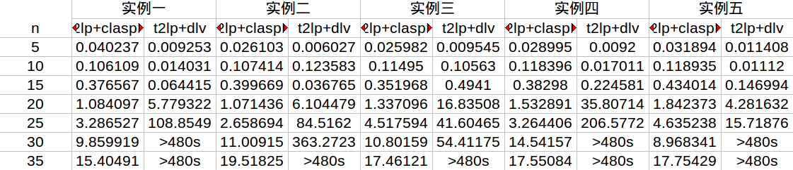
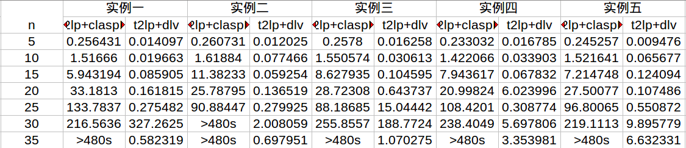

t2lp code!

Environment
========
+ ubuntu14.04(other system is ok), x86_64, 2.2GHCPU

+ install flex bison(in ubuntu you can "sudo apt-get install flex bison")

+ install cmake(in ubuntu you can "sudo apt-get install cmake")

+ install boost1.62.0(install from source, if you meet an error about \_exit() in main.cpp, you should add #include<unistd.h> header ), sudo ./bootstrap.sh && sudo ./b2 && sudo ./b2 install

+ install gringo3.0.5, ([[Download]](http://sourceforge.net/projects/potassco/files/)), cmake . && sudo make  && sudo make install && sudo mv path/gringo /usr/

+ install claspD1.1.4,([[Download]](http://sourceforge.net/projects/potassco/files/)), cmake . && sudo make && sudo make install

Table Results
==========

We list the result of  t2lp+claspD and t2lp+dlv on two problems

clique problem

qsat problem

Code
==========
t2lp/include/  ----------------------some header file

t2lp/parse/    ----------------------lex yacc file

t2lp/src/      ----------------------finishe corresponding header file

t2lp/test/     ----------------------some input  output fact file

t2lp/main.cpp  -----------------------main entrance

testSH/*  ----------------------additional result, such examine time, random test sample, contrast experiment

Code details simple version
============
1 词法分析，语法分析，把输入的公式，存入Formula类

2 将Formula的整条公式，拆分成子公式存入Formulas（双向列表deque）中

3 将公式化成前缀范式

4 将公式化成否定范式

5 采用章衡量词消去的方法（使用到前缀范式，因为全称需要量词补全）

6 将公式应用cabalar转换（对产生的否定式，采用否定范式进一步处理）

7 将公式转成asp（将头部的外延谓词，加上not移入体部，将头部的否定式，加上not移入体部）

Code details complex version
============
1 词法分析和语法分析，把输入的公式，存入Formula类
+ 具体编译设计
描述，各种词法定义和语法定义
+ Formula存储公式的结构
描述各类公式如何存储方式

2.拆分公式

3.前缀范式
+ 补全全程量词，一步一步将量词提到前面（不是一步到位），对蕴含式特殊处理一步，以致于能同时处理合取和析取和蕴含

4.否定范式
注意稳态下~~fml不用化简

5.章衡量词消去
+ 新产生的公式，也要进行再一次处理（也许存在存在量词），所以章衡量词消去是递归处理
新产生的s和t也放入内涵谓词

6.cabalar转换
+ 因为公式的左端都是复杂的，所以先要移动公式，使得左端都要复杂公式（复杂公式包括）

7.asp
+ 对succ的翻译，将头部的外延谓词，加上not移入体部，将头部的否定式，加上not移入体部

Compile
==========

+ modify the root path in t2lp/CmakeList.txt
+ cmake CmakeList.txt
+ make

Run & Test
===========
团染色问题
+ ./t2lp test/color.in  test/color.out
+ gringo test/color.fact  test/color.out | claspD 0
+ ./t2lp test/color.in  test/color.out
+ gringo test/color.fact2  test/color.out | claspD 0
+ ./t2lp test/color.in  test/color.out
+ gringo test/color.fact3  test/color.out | claspD 0
+ ./t2lp test/color.in  test/color.out
+ gringo test/color.fact4  test/color.out | claspD 0

合取范式问题
+ ./t2lp test/cnf.in  test/cnf.out
+ gringo test/cnf.fact  test/cnf.out | claspD 0
+ ./t2lp test/cnf.in  test/cnf.out
+ gringo test/cnf.fact2  test/cnf.out | claspD 0
+ ./t2lp test/cnf.in  test/cnf.out
+ gringo test/cnf.fact3  test/cnf.out | claspD 0

qsat满足问题，也是合取和析取问题

+ ./t2lp test/cnfdnf.in  test/cnfdnf.out
+ gringo test/cnfdnf.fact  test/cnfdnf.out | claspD 0

最小集合问题
+ ./t2lp test/setc.in  test/setc.out
+ gringo test/setc.fact  test/setc.out | claspD 0
+ ./t2lp test/setc.in  test/setc.out
+ gringo test/setc.fact1  test/setc.out | claspD 0
+ ./t2lp test/setc.in  test/setc.out
+ gringo test/setc.fact2  test/setc.out | claspD 0
+ ./t2lp test/setc.in  test/setc.out
+ gringo test/setc.fact3  test/setc.out | claspD 0
+ ./t2lp test/setc.in  test/setc.out
+ gringo test/setc.fact3  test/setc.out | claspD 0

Random test
==========
you should in testSh folder

clique problem in color folder
+ copy color.out in t2lp/test  to color_claspD.lp
+ gcc generatorAndRun.c
+ ./a.out
+ then you see, generator random file and run output saved in log file

qsat problem in qsat folder
+ copy qsat.out in t2lp/test  to qsat_claspD.lp
+ gcc generatorAndRun.c
+ ./a.out
+ then you see, generator random file and run output saved in log file

Experiment
==========

you should in testSh folder

clique problem in color folder
+ copy color.out in t2lp/test  to color_claspD.lp
+ gcc generatorAndRun.c
+ ./a.out
+ then you see, generator random file and run output saved in log file
+ python catch_time.py
+ then you see Excel file and format.txt  in this folder

qsat problem in qsat folder
+ copy qsat.out in t2lp/test  to qsat_claspD.lp
+ gcc generatorAndRun.c
+ ./a.out
+ then you see, generator random file and run output saved in log file
+ python catch_time.py
+ then you see Excel file and format.txt in this folder
