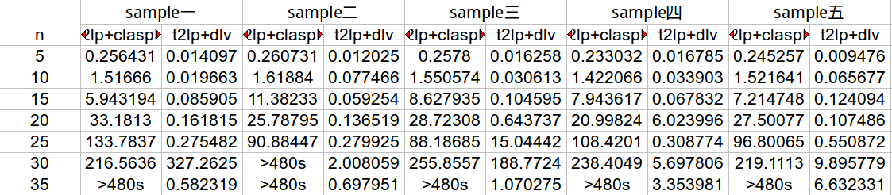

t2lp code!

Environment
========
+ ubuntu14.04(other system is ok), x86_64, 2.2GHCPU

+ install flex bison(in ubuntu you can "sudo apt-get install flex bison")

+ install cmake(in ubuntu you can "sudo apt-get install cmake")

+ install boost1.62.0(install from source, if you meet an error about \_exit() in main.cpp, you should add #include<unistd.h> header ),detail command is "sudo ./bootstrap.sh && sudo ./b2 && sudo ./b2 install"

+ install gringo3.0.5, ([[Download]](http://sourceforge.net/projects/potassco/files/)),detail command is "cmake . && sudo make  && sudo make install && sudo mv path/gringo /usr/"

+ install claspD1.1.4,([[Download]](http://sourceforge.net/projects/potassco/files/)),detail command is "cmake . && sudo make && sudo make install"

Table Results
==========

We list the result of  t2lp+claspD and t2lp+dlv on two problems

clique problem

qsat problem

Code
==========
t2lp/include/  ----------------------some header file

t2lp/parse/    ----------------------lex and yacc file

t2lp/src/      ----------------------finish corresponding header file

t2lp/test/     ----------------------some input, output, fact file

t2lp/main.cpp  -----------------------main function entrance

testSH/*  ----------------------additional result, such as examine time, random test sample, contrast experiment

Code details simple version
============
### Lexical analysis, syntax analysis, and store the input formula in the Formula class

### Split the entire formula in Formula into sub formulas and put them into Formulas(made by bidirectional list deque)

### Transforming formulas into a Prenex Normal Form(PNF)

### Turning the formula into a Negative Normal Form(NNF)

### Using the method of hengZhang's Quantifier Elimination (PNF is used, because it need to complete the quantifier)

### Apply the cabalar transformation to the formula (further to the negative form generated by the method)

###  Convert the formula to ASP (the extension predicate of the head plus the not into the body, the negative form of the head plus the not into the body)

Code details complex version
============
###  Lexical analysis and syntax analysis,

+ Type lexical

|type| regular expression| identification|
| ------------- |:-------------:| -----:|
|predicate| [a-z][a-zA-Z0-9_]* |S_PRED|
|function|[a-z][a-zA-Z0-9_]*| S_FUNC
|variable| [A-Z][a-zA-Z0-9_]* |S_VARI|

+ sign lexical

|type| regular expression| identification|
| ------------- |:-------------:| -----:|
|negative form sign |~| S_NEGA|
|conjunctive form sign|& |S_CONJ|
|disjunctive form sign| &#124; |S_DISJ|
|implication form sign| ->| S_IMPL|
|universal form sign| !| S_UNIV|
|exist form sign|? |S_EXIS|
|period sign |. |PREIOD|
|left parenthesis sign| ( |LPAREN|
|right parenthesis sign| ) |RPAREN|
|left square bracket sign| [ |LBRACKET|
|right square bracket sign|] |RBRACKET|
|comma sign| , |COMMA|
|equal sign |=| EQUAL|
|macro sign| # |MARCO|

+ lexical sign type

|data type| value| annotation|
| ------------- |:-------------:| -----:|
|SYMBOL_TYPE| PREDICATE| predicate|
|SYMBOL_TYPE| FUNCTION |function|
|SYMBOL_TYPE| VARIABLE |variable|

+ syntax analysis

formulas　: formulas formula PERIOD　｜　formula PERIOD

formula　: formula S_CONJ formula | formula S_DISJ formula　| formula S_IMPL formula　| S_NEGA formula 　| LBRACKET S_UNIV S_VARI RBRACKET formula | LBRACKET S_EXIS S_VARI RBRACKET formula　| atom　| LPAREN formula RPAREN

atom: S_PRED LPAREN terms RPAREN　| S_PRED

terms　: terms COMMA term　| term

term	: INTEGER　| S_FUNC　| S_FUNC LPAREN terms RPAREN　

+ parameter type

|data type| value| annotation|
|------------- |:-------------:| -----:|
|TERM_TYPE|VARI|variable parameter|
|TERM_TYPE| FUNC|function parameter|

+ formula type

|data type| value| annotation|
|------------- |:-------------:| -----:|
|FORMULA_TYPE |ATOM |atom proposition|
|FORMULA_TYPE| NEGA |negative form|
|FORMULA_TYPE| UNIV |universal form|
|FORMULA_TYPE| EXIS |exist form|
|FORMULA_TYPE| CONJ |conjunctive form|
|FORMULA_TYPE| DISJ |disjunctive form|
|FORMULA_TYPE| IMPL| implication form|

+ formula data structure

<pre>
typedef struct formula {
    FORMULA_TYPE formula_type;

    union {
        formula* subformula_l;   //NEGA,CONJ,DISJ,IMPL,UNIV,EXIS
        int predicate_id;                 //ATOM
    };
    union {
        formula* subformula_r;   //CONJ,DISJ,IMPL
        int variable_id;                  //UNIV,EXIS
        struct term* parameters;        //ATOM
    };
}_formula;

</pre>

+ detail formula structure  saving formula

atom =====> formula_type = ATOM, predicate_id = id, parameters = some_parameters

nega =====> formula_type = NEGA, subformula_l = other_formula

univ =====> formula_type = UNIV, subformula_l = other_formula, variable_id = id

exis =====> formula_type = Exis, subformula_l = other_formula, variable_id = id

conj =====> formula_type = CONJ, subformula_l = left_formula, subformula_r = right_fourm

disj =====> formula_type = DISJ, subformula_l = left_formula, subformula_r = right_fourm

impl =====> formula_type = IMPL, subformula_l = left_formula, subformula_r = right_fourm

### Spliting formula

According to the conjunctive formula,it is split into several sub formula stored in a deque.

### Prenex Normal Form

Complete the universal quantifier, put quantifier into the front of formula  step by step , with the  special processing of implication, it can deal with conjunctions and disjunctions and Implication together.

for example :[!X]p(X) | [?X]q(X) => [!X][?PN_0](p(X) | q(PN_0)

first step
[!X]p(X) | [?X]q(X)　=> [!X](p(X) | [?PN_0]q(PN_0))

second step
[!X](p(X) | [?PN_0]q(PN_0)) =>[!X][?PN_0](p(X) | q(PN_0)

### Turn the formula into a Negative Normal Form(NNF)
Note that ~~fml does not need to be simplified in stable modle

###  Using the method of hengZhang's Quantifier Elimination
+ The new formula will also be dealt with again (perhaps there are existential quantifiers generated), so the elimination of the quantifier is recursive, and the newly generated S and T are also put into intensional predicates

### cabalar转换
+ Since the left end of the formula is complex, it is necessary to move the formula so that the left end is complex

| | left  tree at root node|right  tree at root node |
|------- |:---------:| ---:|
|Left node of the current node | case 1  current left formula<-The right formula of the root right formula of root<-left formula of root left formula of root<-special sub formula|case 2 current left formula<-left formula of root left formula of root<-special sub formula |
|right node of the current node | case 3 current right formula<-right formula of root  right formula of root<-left formula of root left formula of root<-special sub formula| case 4 current right formula<-left formula of root  left formula of root<-special sub formula|

case 1

<pre>
(true & c) is current node, (true & c) & d is root node  　
(true & c) & d
(d & c) & d
(d　& c) & (d & c)
true & (d & c)
</pre>

case 2
<pre>
 (true & b) is current node,　a & (true & b) is root node
 a & (true & b)
 true & (a & b)
</pre>

case 3
<pre>
 (c & true) & d
 (c & d) &  d
 (c　& d) & (c & d)
 true & (c & d)
</pre>

case 4
<pre>
a & (b & true)
true & (b & a)
</pre>

### asp
+ For the translation of succ, extending predicate of the head plus the not into the body, the negative form of the head plus the not into the body

Compile
==========

+ modify the root path in t2lp/CmakeList.txt
+ cmake CmakeList.txt
+ make

Run & Test
===========
clique problem
+ ./t2lp test/color.in  test/color.out
+ gringo test/color.fact  test/color.out | claspD 0
+ ./t2lp test/color.in  test/color.out
+ gringo test/color.fact2  test/color.out | claspD 0
+ ./t2lp test/color.in  test/color.out
+ gringo test/color.fact3  test/color.out | claspD 0
+ ./t2lp test/color.in  test/color.out
+ gringo test/color.fact4  test/color.out | claspD 0

cnf problem
+ ./t2lp test/cnf.in  test/cnf.out
+ gringo test/cnf.fact  test/cnf.out | claspD 0
+ ./t2lp test/cnf.in  test/cnf.out
+ gringo test/cnf.fact2  test/cnf.out | claspD 0
+ ./t2lp test/cnf.in  test/cnf.out
+ gringo test/cnf.fact3  test/cnf.out | claspD 0

qsat problem

+ ./t2lp test/cnfdnf.in  test/cnfdnf.out
+ gringo test/cnfdnf.fact  test/cnfdnf.out | claspD 0

Minimal set problem
+ ./t2lp test/setc.in  test/setc.out
+ gringo test/setc.fact  test/setc.out | claspD 0
+ ./t2lp test/setc.in  test/setc.out
+ gringo test/setc.fact1  test/setc.out | claspD 0
+ ./t2lp test/setc.in  test/setc.out
+ gringo test/setc.fact2  test/setc.out | claspD 0
+ ./t2lp test/setc.in  test/setc.out
+ gringo test/setc.fact3  test/setc.out | claspD 0
+ ./t2lp test/setc.in  test/setc.out
+ gringo test/setc.fact3  test/setc.out | claspD 0

Random test
==========
you should be in testSh folder

clique problem in color folder
+ copy color.out in t2lp/test  to color_claspD.lp
+ gcc generatorAndRun.c
+ ./a.out
+ then you see, generator random file and run output saved in log file

qsat problem in qsat folder
+ copy qsat.out in t2lp/test  to qsat_claspD.lp
+ gcc generatorAndRun.c
+ ./a.out
+ then you see, generator random file and run output saved in log file

Experiment
==========

you should be in testSh folder

clique problem in color folder
+ copy color.out in t2lp/test  to color_claspD.lp
+ gcc generatorAndRun.c
+ ./a.out
+ then you see, generator random file and run output saved in log file
+ python catch_time.py
+ then you see Excel file and format.txt  in this folder

qsat problem in qsat folder
+ copy qsat.out in t2lp/test  to qsat_claspD.lp
+ gcc generatorAndRun.c
+ ./a.out
+ then you see, generator random file and run output saved in log file
+ python catch_time.py
+ then you see Excel file and format.txt in this folder
