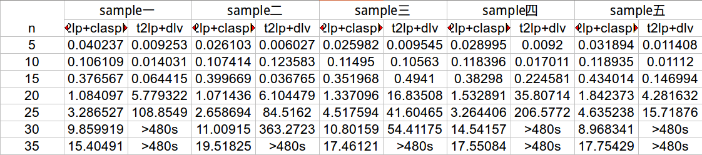

t2lp code!

Environment
========
+ ubuntu14.04(other system is ok), x86_64, 2.2GHCPU

+ install flex bison(in ubuntu you can "sudo apt-get install flex bison")

+ install cmake(in ubuntu you can "sudo apt-get install cmake")

+ install boost1.62.0(install from source, if you meet an error about \_exit() in main.cpp, you should add #include<unistd.h> header ), sudo ./bootstrap.sh && sudo ./b2 && sudo ./b2 install

+ install gringo3.0.5, ([[Download]](http://sourceforge.net/projects/potassco/files/)), cmake . && sudo make  && sudo make install && sudo mv path/gringo /usr/

+ install claspD1.1.4,([[Download]](http://sourceforge.net/projects/potassco/files/)), cmake . && sudo make && sudo make install

Table Results
==========

We list the result of  t2lp+claspD and t2lp+dlv on two problems

clique problem

qsat problem

Code
==========
t2lp/include/  ----------------------some header file

t2lp/parse/    ----------------------lex yacc file

t2lp/src/      ----------------------finishe corresponding header file

t2lp/test/     ----------------------some input  output fact file

t2lp/main.cpp  -----------------------main entrance

testSH/*  ----------------------additional result, such examine time, random test sample, contrast experiment

Code details simple version
============
### 词法分析，语法分析，把输入的公式，存入Formula类

### 将Formula的整条公式，拆分成子公式存入Formulas（双向列表deque）中

### 将公式化成前缀范式

### 将公式化成否定范式

### 采用章衡量词消去的方法（使用到前缀范式，因为全称需要量词补全）

### 将公式应用cabalar转换（对产生的否定式，采用否定范式进一步处理）

### 将公式转成asp（将头部的外延谓词，加上not移入体部，将头部的否定式，加上not移入体部）

Code details complex version
============
### 词法分析和语法分析

+ 类型词法

|类型| 正则表达式| 标识|
| ------------- |:-------------:| -----:|
|谓词| [a-z][a-zA-Z0-9_]* |S_PRED|
|函词 |[a-z][a-zA-Z0-9_]*| S_FUNC
|变量| [A-Z][a-zA-Z0-9_]* |S_VARI|

+ 符号词法

|类型 |正则表达式 |标识|
| ------------- |:-------------:| -----:|
|否定 |~| S_NEGA|
|合取 |& |S_CONJ|
|析取 | &#124; |S_DISJ|
|蕴含| ->| S_IMPL|
|全称| !| S_UNIV|
|存在 |? |S_EXIS|
|句号 |. |PREIOD|
|左圆括号| ( |LPAREN|
|右园括号| ) |RPAREN|
|左方括号| [ |LBRACKET|
|右方括号 |] |RBRACKET|
|逗号| , |COMMA|
|等号 |=| EQUAL|
|宏| # |MARCO|

+ 词法符号类型

|数据类型| 值| 注释|
| ------------- |:-------------:| -----:|
|SYMBOL_TYPE| PREDICATE| 谓词|
|SYMBOL_TYPE| FUNCTION |函词|
|SYMBOL_TYPE| VARIABLE |变量|

+ 语法分析

formulas　: formulas formula PERIOD　｜　formula PERIOD

formula　: formula S_CONJ formula | formula S_DISJ formula　| formula S_IMPL formula　| S_NEGA formula 　| LBRACKET S_UNIV S_VARI RBRACKET formula | LBRACKET S_EXIS S_VARI RBRACKET formula　| atom　| LPAREN formula RPAREN

atom: S_PRED LPAREN terms RPAREN　| S_PRED

terms　: terms COMMA term　| term

term	: INTEGER　| S_FUNC　| S_FUNC LPAREN terms RPAREN　

+ 参数类型

|数据类型| 值 |注释|
|------------- |:-------------:| -----:|
|TERM_TYPE|VARI|变量参数|
|TERM_TYPE| FUNC| 函数参数|

+ 公式类型

|数据类型 |值 |注释|
|------------- |:-------------:| -----:|
|FORMULA_TYPE |ATOM |原子命题|
|FORMULA_TYPE| NEGA |函数参数|
|FORMULA_TYPE| UNIV |全称量词|
|FORMULA_TYPE| EXIS |存在量词|
|FORMULA_TYPE| CONJ |合取式|
|FORMULA_TYPE| DISJ |析取式|
|FORMULA_TYPE| IMPL| 蕴含式|

+ 公式数据结构

<pre>
typedef struct formula {
    FORMULA_TYPE formula_type;

    union {
        formula* subformula_l;   //NEGA,CONJ,DISJ,IMPL,UNIV,EXIS
        int predicate_id;                 //ATOM
    };
    union {
        formula* subformula_r;   //CONJ,DISJ,IMPL
        int variable_id;                  //UNIV,EXIS
        struct term* parameters;        //ATOM
    };
}_formula;

</pre>

+ Formula存储公式的结构

atom =====> formula_type = ATOM, predicate_id = id, parameters = some_parameters

nega =====> formula_type = NEGA, subformula_l = other_formula

univ =====> formula_type = UNIV, subformula_l = other_formula, variable_id = id

exis =====> formula_type = Exis, subformula_l = other_formula, variable_id = id

conj =====> formula_type = CONJ, subformula_l = left_formula, subformula_r = right_fourm

disj =====> formula_type = DISJ, subformula_l = left_formula, subformula_r = right_fourm

impl =====> formula_type = IMPL, subformula_l = left_formula, subformula_r = right_fourm

### 拆分公式

根据合取公式，拆成若干个子公式，存入deque中　

### 前缀范式

补全全程量词，一步一步将量词提到前面（不是一步到位），对蕴含式特殊处理一步，以致于能同时处理合取和析取和蕴含

for example :[!X]p(X) | [?X]q(X) => [!X][?PN_0](p(X) | q(PN_0)

第一步
[!X]p(X) | [?X]q(X)　=> [!X](p(X) | [?PN_0]q(PN_0))

第二步
[!X](p(X) | [?PN_0]q(PN_0)) =>[!X][?PN_0](p(X) | q(PN_0)

### 否定范式
注意稳态下~~fml不用化简

### 章衡量词消去
+ 新产生的公式，也要进行再一次处理（也许存在存在量词），所以章衡量词消去是递归处理
新产生的s和t也放入内涵谓词

### cabalar转换
+ 因为公式的左端都是复杂的，所以先要移动公式，使得左端都要复杂公式（复杂公式包括）

| | 在根节点左子树|在根节点右子树 |
|------- |:---------:| ---:|
|当前节点的左节点 | 情况 1  当前左公式<-根的右公式 根的右公式<-跟的左公式 根的左公式<-特殊子公式|情况 2 当前左公式<-根的左公式 根的左公式<-特殊子公式 |
|当前节点的右节点 | 情况 3 当前右公式<-根的右公式 根的右公式<-跟的左公式 根的左公式<-特殊子公式| 情况 4 当前右公式<-根的左公式 根的左公式<-特殊子公式|

情况 1

<pre>
(true & c)当前节点，(true & c) & d父节点　
(true & c) & d
(d & c) & d
(d　& c) & (d & c)
true & (d & c)
</pre>

情况 2
<pre>
 (true & b)当前节点　a & (true & b)父节点
 a & (true & b)
 true & (a & b)
</pre>

情况 3
<pre>
 (c & true) & d
 (c & d) &  d
 (c　& d) & (c & d)
 true & (c & d)
</pre>

情况 4
<pre>
a & (b & true)
true & (b & a)
</pre>

### asp
+ 对succ的翻译，将头部的外延谓词，加上not移入体部，将头部的否定式，加上not移入体部

Compile
==========

+ modify the root path in t2lp/CmakeList.txt
+ cmake CmakeList.txt
+ make

Run & Test
===========
团染色问题
+ ./t2lp test/color.in  test/color.out
+ gringo test/color.fact  test/color.out | claspD 0
+ ./t2lp test/color.in  test/color.out
+ gringo test/color.fact2  test/color.out | claspD 0
+ ./t2lp test/color.in  test/color.out
+ gringo test/color.fact3  test/color.out | claspD 0
+ ./t2lp test/color.in  test/color.out
+ gringo test/color.fact4  test/color.out | claspD 0

合取范式问题
+ ./t2lp test/cnf.in  test/cnf.out
+ gringo test/cnf.fact  test/cnf.out | claspD 0
+ ./t2lp test/cnf.in  test/cnf.out
+ gringo test/cnf.fact2  test/cnf.out | claspD 0
+ ./t2lp test/cnf.in  test/cnf.out
+ gringo test/cnf.fact3  test/cnf.out | claspD 0

qsat满足问题，也是合取和析取问题

+ ./t2lp test/cnfdnf.in  test/cnfdnf.out
+ gringo test/cnfdnf.fact  test/cnfdnf.out | claspD 0

最小集合问题
+ ./t2lp test/setc.in  test/setc.out
+ gringo test/setc.fact  test/setc.out | claspD 0
+ ./t2lp test/setc.in  test/setc.out
+ gringo test/setc.fact1  test/setc.out | claspD 0
+ ./t2lp test/setc.in  test/setc.out
+ gringo test/setc.fact2  test/setc.out | claspD 0
+ ./t2lp test/setc.in  test/setc.out
+ gringo test/setc.fact3  test/setc.out | claspD 0
+ ./t2lp test/setc.in  test/setc.out
+ gringo test/setc.fact3  test/setc.out | claspD 0

Random test
==========
you should in testSh folder

clique problem in color folder
+ copy color.out in t2lp/test  to color_claspD.lp
+ gcc generatorAndRun.c
+ ./a.out
+ then you see, generator random file and run output saved in log file

qsat problem in qsat folder
+ copy qsat.out in t2lp/test  to qsat_claspD.lp
+ gcc generatorAndRun.c
+ ./a.out
+ then you see, generator random file and run output saved in log file

Experiment
==========

you should in testSh folder

clique problem in color folder
+ copy color.out in t2lp/test  to color_claspD.lp
+ gcc generatorAndRun.c
+ ./a.out
+ then you see, generator random file and run output saved in log file
+ python catch_time.py
+ then you see Excel file and format.txt  in this folder

qsat problem in qsat folder
+ copy qsat.out in t2lp/test  to qsat_claspD.lp
+ gcc generatorAndRun.c
+ ./a.out
+ then you see, generator random file and run output saved in log file
+ python catch_time.py
+ then you see Excel file and format.txt in this folder
